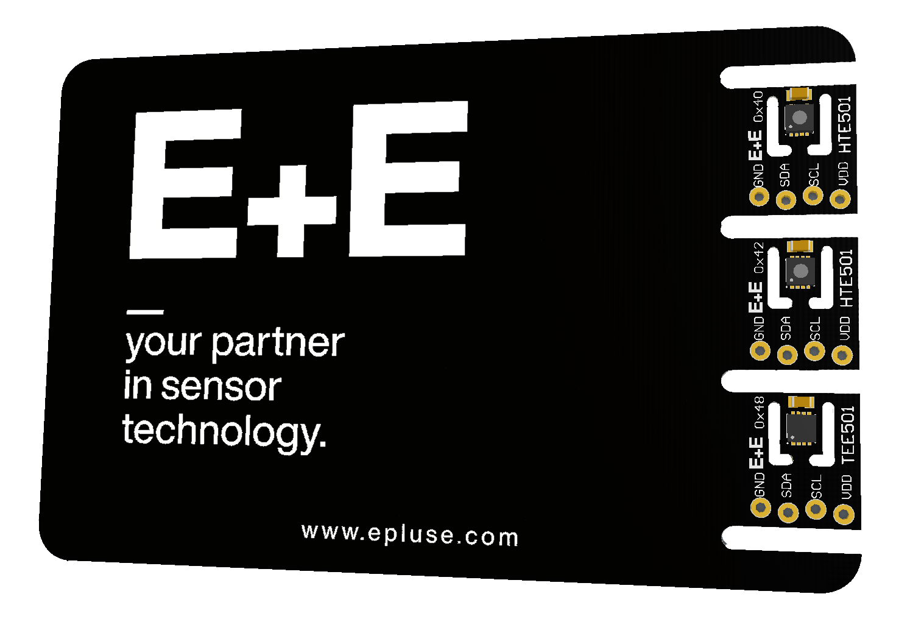
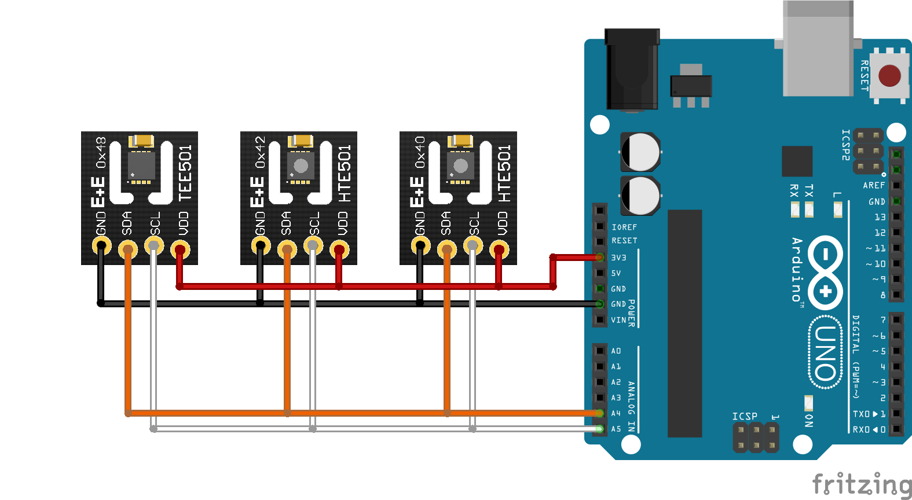

# business card breakoutboad

## GUIDE  

### Components 
- Business card breakoutboard
- Arduino
- Wire jumper cable  
 

### librarys
Please note that the libraries HTE501 and TEE501 must be included. (https://github.com/epluse/hte501_i2c_arduino)(https://github.com/epluse/tee501_i2c_arduino)

| Step |                                                                                                                                                             |
|------|-------------------------------------------------------------------------------------------------------------------------------------------------------------|
| 1    | Break off the individual elements from the business card. | 
| 2    | Connect the 3 sensor module with the Arduino according to the following scheme:  |
| 3    | Download and install the Arduino IDE (https://www.arduino.cc/en/software). Version >1.8.7 recommended.                                                            |
| 4    | Download the ZIP File of this project.|
| 5    | Open the arduino software.|
| 6    | Open the arduino file from this Repository.|
| 7    | Connect the Arduino to your PC via the USB cable. Select Board “Arduino Uno” and the appropriate COM-Port from Tools menu and upload the sketch |
| 8    | When the upload is finished, open the the "Serial Monitor" with the key combination (Control + Shift + M) or via the menu bar:    |
 

 

## License 
See [LICENSE](LICENSE).